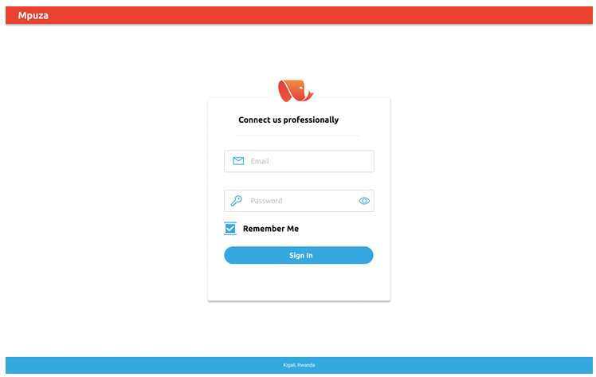

---


Mpuza is designed to connect professionals across Rwanda and beyond. This login component is built with a "Mobile-First" philosophy, ensuring that whether a user is accessing the platform from a smartphone in Kigali or a workstation abroad, the experience remains consistent and professional.

---

## Screenshot of output



##  Key Features
* **Contextual Inputs:** Icon-integrated input fields for intuitive data entry.
* **Password Visibility:** Built-in toggle support for user convenience.
* **Responsive Scaling:** Adapts fluidly to all screen dimensions (320px to 4K).
* **Visual Hierarchy:** Uses clean dividers and bold calls-to-action to guide the user.
* **Localized Footer:** Proudly displaying the project's roots in **Kigali, Rwanda**.

##  Tech Stack
* **HTML5:** Utilizing semantic tags (`<main>`, `<header>`, `<footer>`) for SEO and accessibility.
* **CSS3:** Advanced styling using Flexbox for perfect centering and custom transitions.
* **FontAwesome 7.0:** Providing the latest in vector iconography.
* **Google Fonts:** (Recommended: 'Inter' or 'Poppins') for a modern corporate look.

---

##  Installation & Usage

### Prerequisites
* A modern web browser (Chrome, Firefox, Edge, or Safari).
* A code editor like VS Code.

### Setup Instructions
1.  **Clone the Repository**
    ```bash
    git clone [https://github.com/your-username/mpuza-login.git](https://github.com/your-username/mpuza-login.git)
    ```
2.  **Navigate to the Directory**
    ```bash
    cd mpuza-login
    ```
3.  **Launch the Page**
    Open `index.html` directly in your browser or use the **Live Server** extension in VS Code.

---

##  UI Architecture (CSS Logic)
The styling follows a **Glass-Card** aesthetic:
* **Containers:** Max-width constraints to prevent "stretching" on wide monitors.
* **Interactive States:** Hover effects on the "Sign In" button and input focus outlines for accessibility.
* **Color Palette:** Professional blues/slates paired with high-contrast whites.

---

##  Future Roadmap
- [ ] Implement OAuth2 (Sign in with Google/LinkedIn).
- [ ] Add Dark Mode toggle.
- [ ] Integrate 2-Factor Authentication (2FA) UI.
- [ ] Add "Forgot Password" recovery flow.

---

##  Contributing
Contributions are what make the open-source community such an amazing place to learn, inspire, and create.
1. Fork the Project.
2. Create your Feature Branch (`git checkout -b feature/AmazingFeature`).
3. Commit your Changes (`git commit -m 'Add some AmazingFeature'`).
4. Push to the Branch (`git push origin feature/AmazingFeature`).
5. Open a Pull Request.

---
